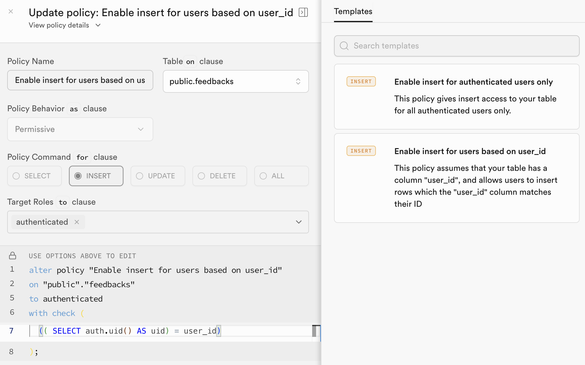
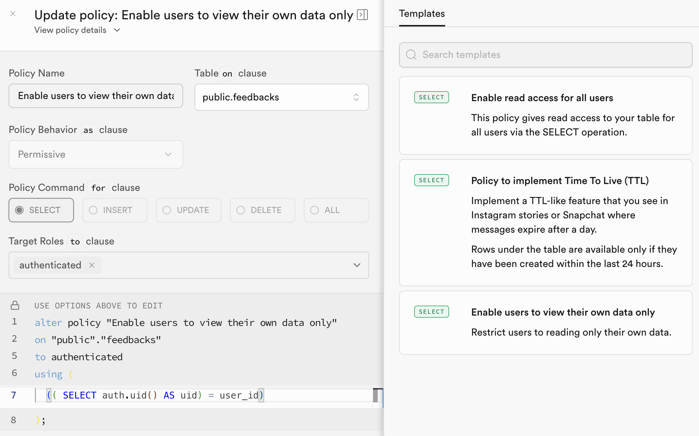

# Supabase Setup

This project uses Supabase as the backend for Authentication and Database.

## 1. Project Configuration

1.  Create a new project on [Supabase.com](https://supabase.com/).
2.  Once created, go to **Settings** -> **API**.
3.  Copy the following keys and update your `.env` file (see `.env.example`):
    - **Project URL**: `NEXT_PUBLIC_SUPABASE_URL`
    - **Anon / Public Key**: `NEXT_PUBLIC_SUPABASE_ANON_KEY`
    - **Service Role Key** (for n8n only): `SUPABASE_SERVICE_ROLE_KEY`
4.  For Supabase Auth, you'll need the OAuth Client ID and Secret if using a custom provider, or just configure the Email/Password provider in **Authentication** -> **Providers**.

## 2. Row Level Security (RLS)

The `feedbacks` table must be secured to ensure data privacy.

### Enable RLS

Running the migration should create the table, but you should ensure RLS is enabled.
Access the Table Editor in Supabase, select `feedbacks`, and check if RLS is enabled.

### Policies

We need to set up two main policies:

#### 1. Insert Policy (Authenticated Users Only)

Users can only insert feedback if they are authenticated, and they should only be able to insert rows where `user_id` matches their own ID.

- **Name**: "Enable insert for authenticated users only"
- **Target Role**: `authenticated`
- **WITH CHECK expression**: `auth.uid() = user_id`



#### 2. Select Policy (Own Data Only)

Users can only read their own feedback submissions.

- **Name**: "Enable users to view their own data only"
- **Target Role**: `authenticated`
- **USING expression**: `auth.uid() = user_id`



## 3. Realtime Updates

To enable the frontend to receive real-time updates when the n8n workflow updates a feedback status (e.g. from "Pending" to "Processed"), we need to set up a Database Webhook or use Supabase Realtime Broadcasts.

Run the following SQL in the **SQL Editor** of your Supabase dashboard to set up the broadcast trigger:

```sql
-- 1) Create trigger function to broadcast changes for feedbacks
CREATE OR REPLACE FUNCTION public.feedbacks_broadcast_trigger()
RETURNS TRIGGER
SECURITY DEFINER
LANGUAGE plpgsql
AS $$
BEGIN
  PERFORM realtime.broadcast_changes(
    'feedbacks', -- topic
    TG_OP,                                         -- event
    TG_OP,                                         -- operation
    TG_TABLE_NAME,                                 -- table
    TG_TABLE_SCHEMA,                               -- schema
    NEW,                                           -- new record
    OLD                                            -- old record
  );
  RETURN NULL;
END;
$$;

-- 2) Create trigger to call the function after insert or update
DROP TRIGGER IF EXISTS feedbacks_broadcast_trigger ON public.feedbacks;
CREATE TRIGGER feedbacks_broadcast_trigger
  AFTER INSERT OR UPDATE ON public.feedbacks
  FOR EACH ROW EXECUTE FUNCTION public.feedbacks_broadcast_trigger();

-- 3) Ensure authenticated users can select/insert on realtime.messages for authorization
CREATE POLICY IF NOT EXISTS "authenticated can receive broadcasts" ON realtime.messages
  FOR SELECT
  TO authenticated
  USING (true);

CREATE POLICY IF NOT EXISTS "authenticated can send broadcasts" ON realtime.messages
  FOR INSERT
  TO authenticated
  WITH CHECK (true);
```

## 4. Environment Variables

To retrieve the keys needed for your `.env` file:

1.  Go to your Supabase Project Dashboard.
2.  Navigate to **Settings** (Icon at the bottom of the left sidebar).
3.  Select **API**.
4.  Find **Project URL** and **Project API keys**.
    - `NEXT_PUBLIC_SUPABASE_URL` is the **Project URL**.
    - `NEXT_PUBLIC_SUPABASE_ANON_KEY` is the **anon** public key.
    - `SUPABASE_SERVICE_ROLE_KEY` is the **service_role** secret key (needed for n8n).
5.  Check your Auth settings for OAuth credentials if you are using Social Logins.
